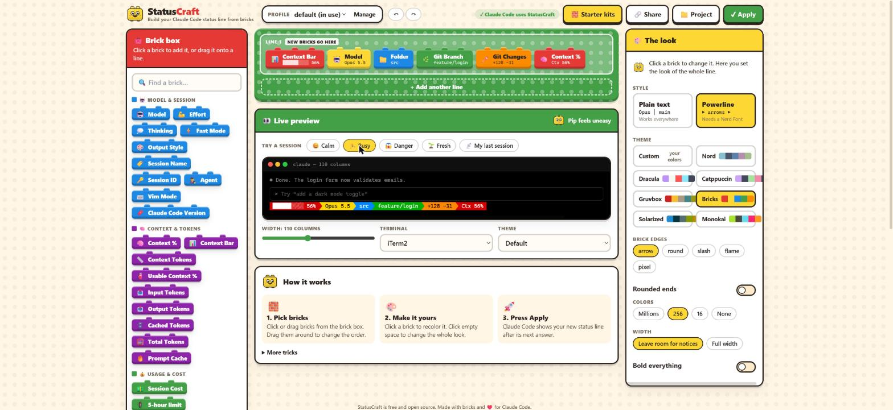

<p align="center">
  
</p>

<h1 align="center">StatusCraft</h1>

<p align="center"><b>Build your Claude Code status line and mods from bricks.</b><br/>
Drag, drop, pick colors, press Apply. No scripts, no JSON, no fuss.</p>

<p align="center">
  
</p>

## Start in 10 seconds

You need [Node.js](https://nodejs.org) 20 or newer. In any terminal:

```sh
npx statuscraft init
```

Pick a starter kit, and you are done. Your new status line appears after Claude's next answer.

Want to change it? Open the brick editor:

```sh
npx statuscraft
```

Drag bricks onto the baseplate, click one to recolor it, watch the live preview, and press **Apply to Claude Code**.

## What you get

- **A drag-and-drop editor** with a live preview in your terminal's colors. Try your design in a calm, busy, danger or brand new session, or with the data from your last real one.
- **43 bricks**: model, context bar, tokens, prompt cache, cost, 5-hour and weekly limits with reset countdowns, git branch and changes, pull request status, session timers, custom text and commands, and more. See [all widgets](docs/widgets.md).
- **Warning colors** that turn a brick yellow, then red, when context or limits run low.
- **Pip**, the brick mascot, who smiles while your session is fine and panics when it is not: `(^_^)` → `(•_•)` → `(×_×)`.
- **8 starter kits**, from Minimal to a two-line powerline dashboard. See [the starter kits](docs/presets.md).
- **Plain text or powerline** looks, with 8 themes. The editor draws the arrows even without a Nerd Font, so you can preview before installing one.
- **Profiles** for different moods, which switch on by themselves in the repos or folders you choose.
- **Per-project status lines** you can commit and share with your team.
- **Share codes**: send a design as one line of text, and load it with one command.
- **Backed-up install**: existing Claude settings are backed up before setup, your old status line is saved, and `npx statuscraft uninstall` puts it back.

## Mods: change Claude Code itself

Press **🧩 Mods** at the top of the editor. You get a pretend Claude Code terminal with dashed spots, and a box of 20 ready-made mods. Drag a mod onto the terminal (or click it), tweak it on the right, and press **Apply**.

| Spot | Mods |
| --- | --- |
| Above the prompt | **Live Status Line** (your status line, ticking every second), **Context Meter** (bar and sparkline), **Banner Text**, **Burn Rate** (cost per hour, and whether your 5-hour limit lasts until it resets), **Limit Bars** (5-hour and weekly limits with reset countdowns) |
| Spinner | **Tool Counter**, **Turn Timer**, **Active Tool**, **Pip in the Spinner**, **Spinner Words** |
| Tool calls | **Tool Timer**: how long a slow tool call took, on its row |
| Under each answer | **Turn Summary**: time, tools and tokens |
| Prompt hint | **Prompt Hint**, with `{branch}`, `{context}`, `{model}` and more |
| Pop-up alerts | **Context Alert**, **Limit Alert**, **Done Alert** (a long answer is finished) |
| Safety guards | **Danger Guard**: asks you before `rm -rf`, force pushes and `git reset --hard`. **Protected Files**: asks before Claude edits matching files using its file tools. Guards never say yes for you. |
| Prompt shortcuts | **Prompt Shortcuts**: type `;tests` and it grows into a full prompt when you send it |
| Slash commands | **Quick Command**: `/gs` runs `git status --short` after you review and approve that exact shell command |

Mods need Claude Code 2.1.287 or newer. The first Apply adds the StatusCraft mod to Claude Code for you; after that, open sessions pick up your changes within a couple of seconds. Your mods live in `~/.config/statuscraft/mods.json`. From a terminal: `npx statuscraft mods`, `mods install` and `mods uninstall`.

## Profiles and projects

A **profile** is a saved design. Make one per mood (work, focus, fun) in the editor under **Profile → Manage**, and tell StatusCraft when to use it:

| When | Uses |
| --- | --- |
| `STATUSCRAFT_PROFILE=focus claude` | that profile, for that session |
| `/statuscraft profile focus` (needs the plugin) | that profile, for this session only |
| `.claude/statuscraft.local.json` in the project | that design, just for you |
| `.claude/statuscraft.json` in the project | that design, for everyone who works on the repo |
| A rule, like "repos matching `acme/*`" | that profile |
| Otherwise | the profile you marked as default |

To save a design for one project, press **📁 Project** in the editor, or run `npx statuscraft apply <preset or code> --project`.

## The Claude Code plugin (optional)

The status line works on its own. The plugin adds what a status line script cannot see:

- the **Turn Timer** brick (how long Claude has been working) and the **Tool Calls** brick
- `/statuscraft profile <name>` to switch profiles for one session
- `/statuscraft setup` and `/statuscraft doctor` without leaving Claude Code

Install it from Claude Code:

```
/plugin marketplace add statuscraft/statuscraft
/plugin install statuscraft@statuscraft
```

The plugin is a [Claude Code mod](https://code.claude.com/docs/en/plugins/mods/overview), so it needs Claude Code 2.1.287 or newer.

## Commands

| Command | What it does |
| --- | --- |
| `npx statuscraft` | Open the brick editor |
| `npx statuscraft init` | Pick a starter kit and switch Claude Code over |
| `npx statuscraft presets` | Show every starter kit, drawn for real |
| `npx statuscraft apply <preset \| code \| file>` | Use a preset, a share code (`sc1.…`) or a JSON file. Add `--profile <name>`, `--project` or `--local` |
| `npx statuscraft profile` / `profile use <name>` | List profiles, or switch the default |
| `npx statuscraft trust` | Review shell commands before enabling them; `--project`, `--mods` or `--revoke` |
| `npx statuscraft doctor` | Find out why something does not show |
| `npx statuscraft uninstall` | Put your previous status line back |

## Backups and command safety

Before first creating StatusCraft's config or changing Claude settings, setup backs up an existing `settings.json`. If the settings cannot be read or the backup cannot be written, setup stops. The first snapshot is `settings.json.before-statuscraft`; subsequent snapshots are kept in `settings.json.backups/`. Existing StatusCraft config, mods, project files and command approvals are also backed up before replacement, in `<filename>.backups/`, with a timestamp and unique name. Missing files have nothing to back up. Imported CCStatuskit settings are copied to `legacy-settings.json.backups/` inside the StatusCraft config folder before the new config is created; the legacy file and its folder are left untouched.

Writes use temporary files and atomic replacement. StatusCraft operations lock the file while updating it, and reject detected concurrent edits. The editor refuses stale saves; reload it to pick up the newer version. Symlinked settings/config files are left untouched, with an error. Backups can contain secrets from your settings: keep them private and do not commit them.

**Command widgets and Quick Command mods start disabled**, including commands in existing configs, imported share codes and project layouts. The local editor shows the exact commands and asks before enabling them. Cancel saves the design with unapproved commands disabled. From a terminal:

```sh
npx statuscraft trust                  # review commands in your global profiles
npx statuscraft trust --project        # review this project's selected layout
npx statuscraft trust --mods           # review Quick Command mods
npx statuscraft trust --revoke         # revoke all command approvals
```

Approvals live in your user config, not inside shared designs. Project approvals apply only to that project's real folder. Changing the command text requires approval again. Global approvals apply across projects, with commands running in the current folder. Approving a command trusts its executable, scripts and inputs too: changing a script behind an unchanged command does not automatically revoke approval. Commands have your user permissions and run outside Claude Code's tool approval checks; only approve code you trust.

Mods run inside Claude Code with your permissions. Danger Guard and Protected Files are reminders for supported tool calls, not a sandbox: they do not cover every destructive command, shell-based file edit or program a mod starts. Existing deny decisions are preserved; a failed enabled guard asks, or denies when it cannot verify the underlying decision. See [Anthropic's mod security guidance](https://code.claude.com/docs/en/plugins/mods/overview#what-a-mod-can-reach).

To remove both integrations, run `npx statuscraft uninstall` and `npx statuscraft mods uninstall`. Your saved designs remain. If a mod disrupts a session, start `claude --safe-mode` and disable the plugin. If restoring settings from a backup, compare it with the current settings and restore only the entries you need, so later changes are preserved.

## Where things live

| File | What it holds |
| --- | --- |
| `~/.config/statuscraft/config.json` | Your profiles and rules ([JSON schema](https://unpkg.com/statuscraft/schema.json)) |
| `~/.config/statuscraft/trusted-commands.json` | Your exact shell-command approvals; never shared with a design |
| `~/.config/statuscraft/mods.json` | The mods you placed in the editor |
| `~/.config/statuscraft/bin/statuscraft-render.mjs` | The small program Claude Code runs to draw the line |
| `.claude/statuscraft.json` | A project's design, shared with the team |
| `.claude/statuscraft.local.json` | A project's design, just for you |
| `~/.cache/statuscraft/` | Git info cache, the last session's data for the preview, and plugin stats |

`init` adds this to `~/.claude/settings.json`, after saving a copy as `settings.json.before-statuscraft`:

```json
{ "statusLine": { "type": "command", "command": "/path/to/node ~/.config/statuscraft/bin/statuscraft-render.mjs", "padding": 0 } }
```

Coming from CCStatuskit? Your `~/.config/ccstatuskit/settings.json` is imported automatically the first time.

## Troubleshooting

Run `npx statuscraft doctor` first. It checks Node, your config, the Claude Code settings, git, and draws a sample.

- **Boxes or question marks instead of arrows**: powerline looks need a [Nerd Font](https://www.nerdfonts.com) in your terminal. Or pick a plain-text look.
- **Nothing shows**: Claude Code only runs status lines in folders you trusted, and not at all when `disableAllHooks` is on.
- **The clock does not tick**: Claude Code redraws the status line after each answer. Add `"refreshInterval": 1` to the `statusLine` block for a live clock.

## Contributing

StatusCraft is MIT licensed and contributions are welcome. Adding a brick takes one entry in one file. See [CONTRIBUTING.md](CONTRIBUTING.md).

## Credits

StatusCraft grew out of CCStatuskit and is inspired by [ccstatusline](https://github.com/sirmalloc/ccstatusline) by Matthew Breedlove. Thank you! See [third-party notices](THIRD_PARTY_NOTICES.md) for the upstream license and attribution.
